# Lead Agent System - Design Document

## 📋 Table of Contents

1. [Introduction](#introduction)
2. [System Architecture](#system-architecture)
3. [Design Patterns](#design-patterns)
4. [Resilience Patterns](#resilience-patterns)
5. [Execution Scenarios](#execution-scenarios)
   - [Success Scenarios](#success-scenarios)
   - [Failure Scenarios](#failure-scenarios)
   - [Partial Failure Scenarios](#partial-failure-scenarios)
6. [AI-Specific Design Patterns](#ai-specific-design-patterns)
7. [State Management](#state-management)
8. [Implementation Guidelines](#implementation-guidelines)
9. [Conclusion](#conclusion)

---

## 1. Introduction

The Lead Agent system is a sophisticated AI workflow orchestration platform designed to handle complex multi-agent communication with enterprise-grade reliability patterns. This design document provides comprehensive visual documentation of the system architecture, design patterns, and execution scenarios.

### 1.1 Key Features

- **Multi-Agent Orchestration**: Seamless communication with AI agents, MCP servers, and HTTP APIs
- **Enterprise Reliability**: Circuit breaker, retry, and timeout patterns
- **Flexible Execution**: Parallel and sequential workflow strategies
- **Partial Failure Recovery**: Continue execution despite individual task failures
- **AI-Specific Patterns**: Advanced patterns for AI workflow coordination

### 1.2 Design Principles

- **Modularity**: Clean separation of concerns with well-defined interfaces
- **Extensibility**: Plugin-based architecture for easy extension
- **Reliability**: Comprehensive error handling and recovery mechanisms
- **Observability**: Event-driven architecture with comprehensive monitoring
- **Scalability**: Support for parallel execution and resource isolation

---

## 2. System Architecture

### 2.1 Overall System Architecture

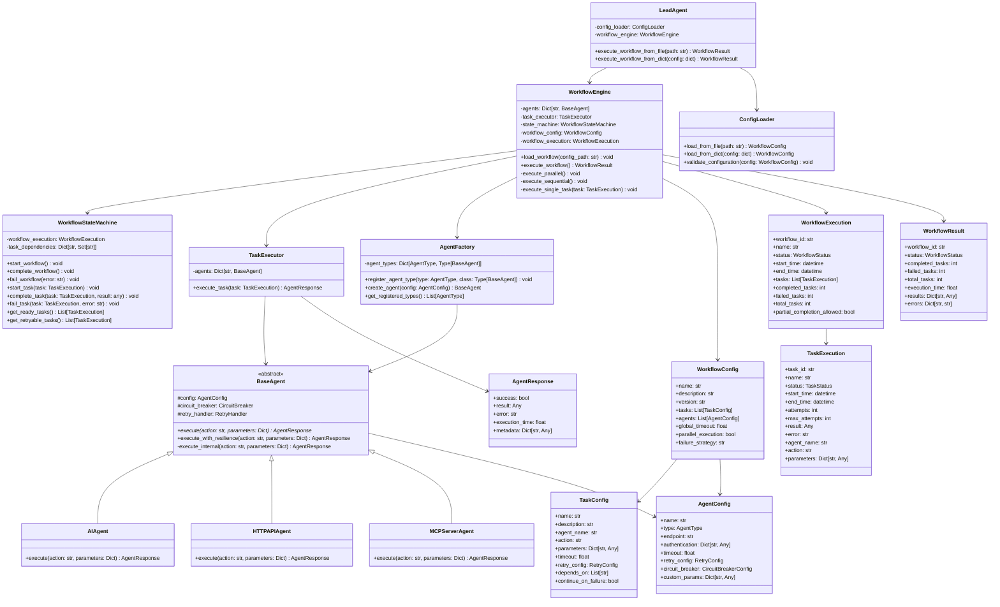

### 2.2 Architecture Overview

The Lead Agent system follows a layered architecture with clear separation of concerns:

- **Presentation Layer**: LeadAgent facade providing simple API
- **Orchestration Layer**: WorkflowEngine managing workflow execution
- **State Management Layer**: WorkflowStateMachine handling state transitions
- **Execution Layer**: TaskExecutor coordinating agent interactions
- **Agent Layer**: Specialized agents for different communication protocols
- **Infrastructure Layer**: Resilience patterns and configuration management

---

## 3. Design Patterns

The system implements multiple design patterns to ensure maintainability, extensibility, and reliability.

### 3.1 Core Design Patterns

```mermaid
classDiagram
    %% Strategy Pattern - Agent Communication Strategies
    class BaseAgent {
        <<abstract>>
        #config: AgentConfig
        +execute(action: str, parameters: Dict) AgentResponse*
    }
    
    class AIAgent {
        +execute(action: str, parameters: Dict) AgentResponse
        -prepare_ai_payload(action: str, parameters: Dict) Dict
        -handle_ai_response(response: Any) AgentResponse
    }
    
    class HTTPAPIAgent {
        +execute(action: str, parameters: Dict) AgentResponse
        -build_http_request(action: str, parameters: Dict) HttpRequest
        -process_http_response(response: HttpResponse) AgentResponse
    }
    
    class MCPServerAgent {
        +execute(action: str, parameters: Dict) AgentResponse
        -create_mcp_payload(action: str, parameters: Dict) Dict
        -parse_mcp_response(response: Any) AgentResponse
    }
    
    %% Factory Pattern - Agent Creation
    class AgentFactory {
        -agent_types: Dict[AgentType, Type[BaseAgent]]
        +register_agent_type(type: AgentType, class: Type[BaseAgent]) void
        +create_agent(config: AgentConfig) BaseAgent
        +get_registered_types() List[AgentType]
    }
    
    class AgentType {
        <<enumeration>>
        AI_AGENT
        HTTP_API
        MCP_SERVER
        CUSTOM
    }
    
    %% Observer Pattern - Event Notifications
    class Subject {
        -observers: List[Observer]
        +attach(observer: Observer) void
        +detach(observer: Observer) void
        +notify(event_type: str, data: Any) void
    }
    
    class Observer {
        <<abstract>>
        +update(subject: Subject, event_type: str, data: Any) void*
    }
    
    class WorkflowStateMachine {
        +notify(event_type: str, data: Any) void
    }
    
    class WorkflowEngine {
        +update(subject: Subject, event_type: str, data: Any) void
    }
    
    class EventLogger {
        +update(subject: Subject, event_type: str, data: Any) void
    }
    
    class MetricsCollector {
        +update(subject: Subject, event_type: str, data: Any) void
    }
    
    %% Command Pattern - Task Execution
    class TaskExecution {
        +task_id: str
        +name: str
        +action: str
        +parameters: Dict[str, Any]
        +agent_name: str
        +execute() AgentResponse
        +undo() void
        +get_status() TaskStatus
    }
    
    class TaskCommand {
        <<interface>>
        +execute() AgentResponse
        +undo() void
        +can_undo() bool
    }
    
    class AITaskCommand {
        -agent: AIAgent
        -task: TaskExecution
        +execute() AgentResponse
        +undo() void
    }
    
    class HTTPTaskCommand {
        -agent: HTTPAPIAgent
        -task: TaskExecution
        +execute() AgentResponse
        +undo() void
    }
    
    %% State Pattern - Workflow States
    class WorkflowState {
        <<abstract>>
        +start_workflow(context: WorkflowContext) void*
        +complete_task(context: WorkflowContext, task: TaskExecution) void*
        +fail_task(context: WorkflowContext, task: TaskExecution) void*
        +complete_workflow(context: WorkflowContext) void*
    }
    
    class PendingState {
        +start_workflow(context: WorkflowContext) void
        +complete_task(context: WorkflowContext, task: TaskExecution) void
        +fail_task(context: WorkflowContext, task: TaskExecution) void
        +complete_workflow(context: WorkflowContext) void
    }
    
    class RunningState {
        +start_workflow(context: WorkflowContext) void
        +complete_task(context: WorkflowContext, task: TaskExecution) void
        +fail_task(context: WorkflowContext, task: TaskExecution) void
        +complete_workflow(context: WorkflowContext) void
    }
    
    class CompletedState {
        +start_workflow(context: WorkflowContext) void
        +complete_task(context: WorkflowContext, task: TaskExecution) void
        +fail_task(context: WorkflowContext, task: TaskExecution) void
        +complete_workflow(context: WorkflowContext) void
    }
    
    class FailedState {
        +start_workflow(context: WorkflowContext) void
        +complete_task(context: WorkflowContext, task: TaskExecution) void
        +fail_task(context: WorkflowContext, task: TaskExecution) void
        +complete_workflow(context: WorkflowContext) void
    }
    
    class WorkflowContext {
        -state: WorkflowState
        -execution: WorkflowExecution
        +set_state(state: WorkflowState) void
        +get_state() WorkflowState
        +start_workflow() void
        +complete_task(task: TaskExecution) void
        +fail_task(task: TaskExecution) void
        +complete_workflow() void
    }
    
    %% Relationships
    BaseAgent <|-- AIAgent
    BaseAgent <|-- HTTPAPIAgent
    BaseAgent <|-- MCPServerAgent
    AgentFactory --> BaseAgent
    AgentFactory --> AgentType
    
    Subject <|-- WorkflowStateMachine
    Observer <|-- WorkflowEngine
    Observer <|-- EventLogger
    Observer <|-- MetricsCollector
    Subject --> Observer
    
    TaskCommand <|-- AITaskCommand
    TaskCommand <|-- HTTPTaskCommand
    TaskExecution --> TaskCommand
    
    WorkflowState <|-- PendingState
    WorkflowState <|-- RunningState
    WorkflowState <|-- CompletedState
    WorkflowState <|-- FailedState
    WorkflowContext --> WorkflowState
    WorkflowStateMachine --> WorkflowContext
```

### 3.2 Pattern Descriptions

#### Strategy Pattern
- **Purpose**: Enables different agent communication strategies
- **Implementation**: BaseAgent interface with concrete implementations for AI, HTTP, and MCP agents
- **Benefits**: Easy to add new agent types without modifying existing code

#### Factory Pattern
- **Purpose**: Dynamic agent creation based on configuration
- **Implementation**: AgentFactory with type registration mechanism
- **Benefits**: Loose coupling between agent creation and usage

#### Observer Pattern
- **Purpose**: Event-driven architecture for workflow monitoring
- **Implementation**: Subject/Observer pattern with WorkflowStateMachine as subject
- **Benefits**: Decoupled event handling and extensible monitoring

#### Command Pattern
- **Purpose**: Encapsulate task execution requests
- **Implementation**: TaskExecution as command objects with execute/undo capabilities
- **Benefits**: Supports undo operations and request queuing

#### State Pattern
- **Purpose**: Manage complex workflow state transitions
- **Implementation**: WorkflowState hierarchy with context management
- **Benefits**: Clean state management and easy addition of new states

---

## 4. Resilience Patterns

The system implements comprehensive resilience patterns to handle failures gracefully.

### 4.1 Resilience Pattern Architecture

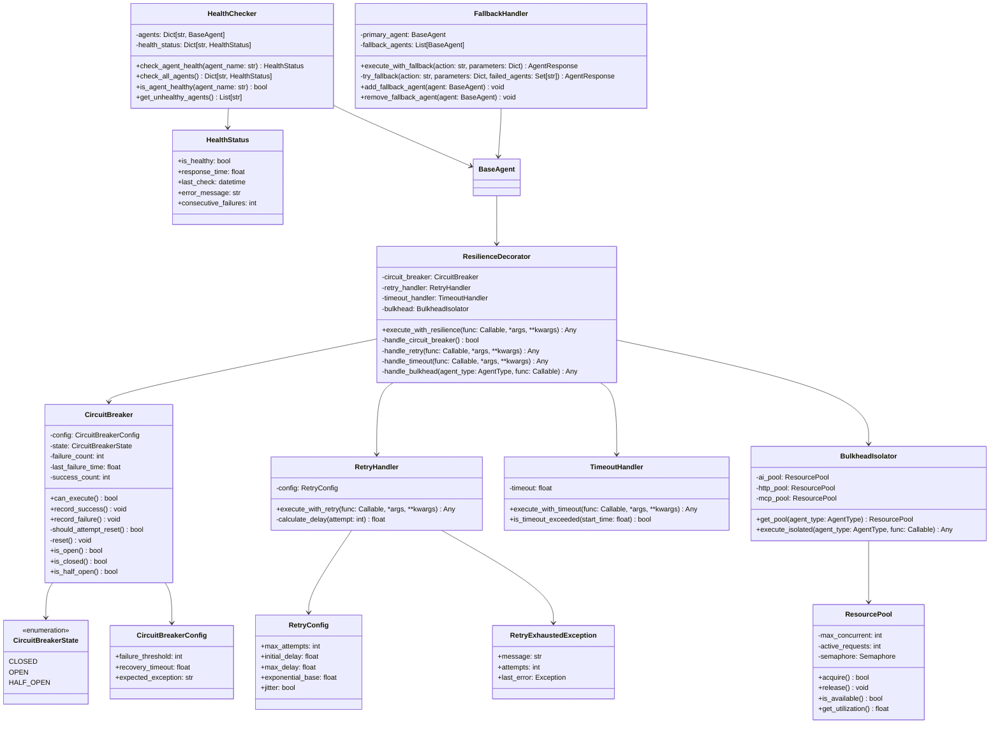

### 4.2 Circuit Breaker State Transitions

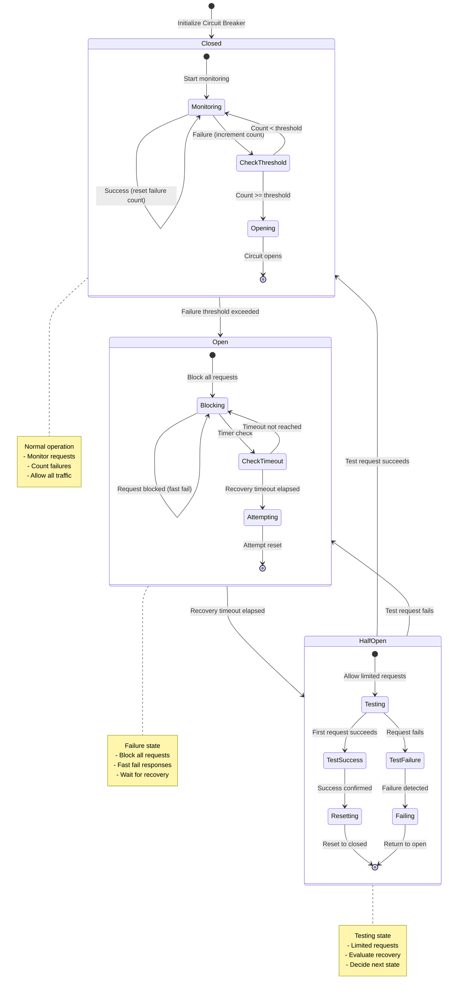

### 4.3 Resilience Pattern Benefits

- **Circuit Breaker**: Prevents cascading failures and provides fast-fail behavior
- **Retry with Exponential Backoff**: Handles transient failures with intelligent backoff
- **Timeout**: Prevents resource exhaustion from hanging requests
- **Bulkhead**: Isolates failures to specific agent types
- **Health Checks**: Proactive monitoring of agent availability
- **Fallback**: Graceful degradation when primary agents fail

---

## 5. Execution Scenarios

### 5.1 Success Scenarios

#### 5.1.1 Sequential Workflow Execution

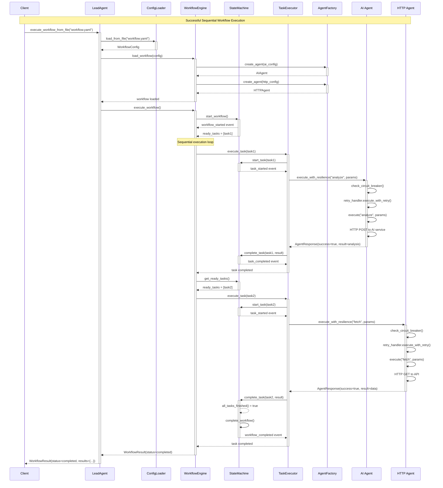

#### 5.1.2 Parallel Workflow Execution

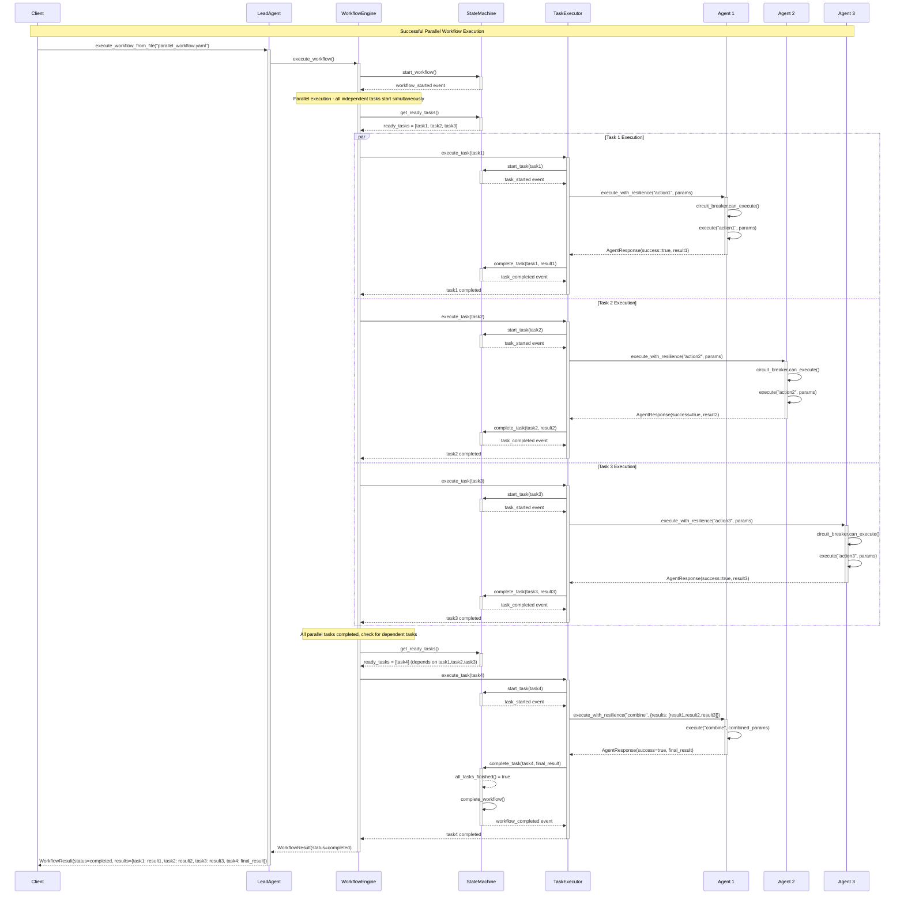

### 5.2 Failure Scenarios

#### 5.2.1 Circuit Breaker Activation

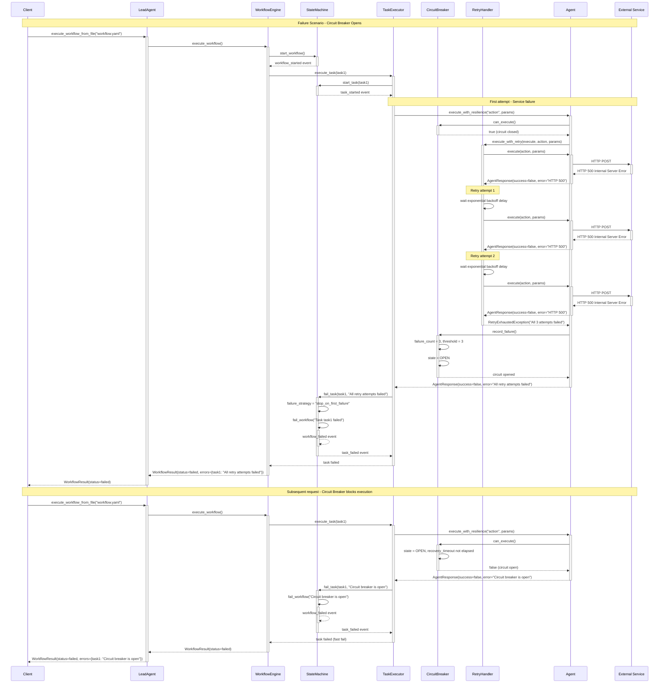

#### 5.2.2 Timeout and Cascading Failures

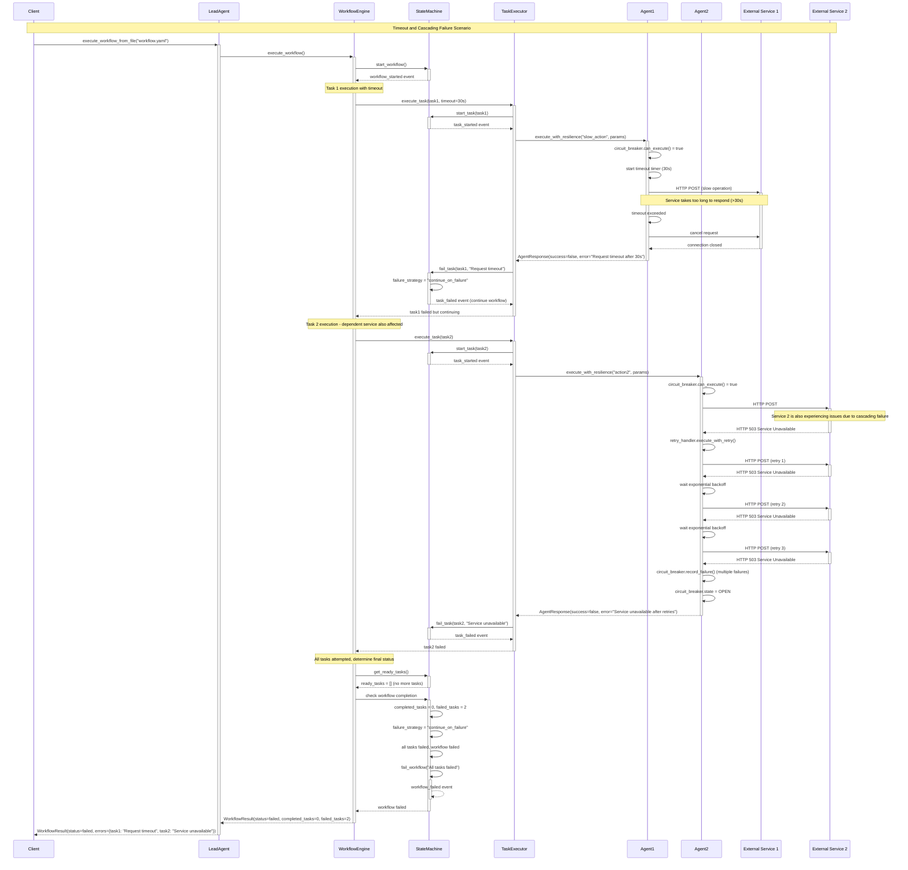

### 5.3 Partial Failure Scenarios

#### 5.3.1 Continue on Failure Strategy

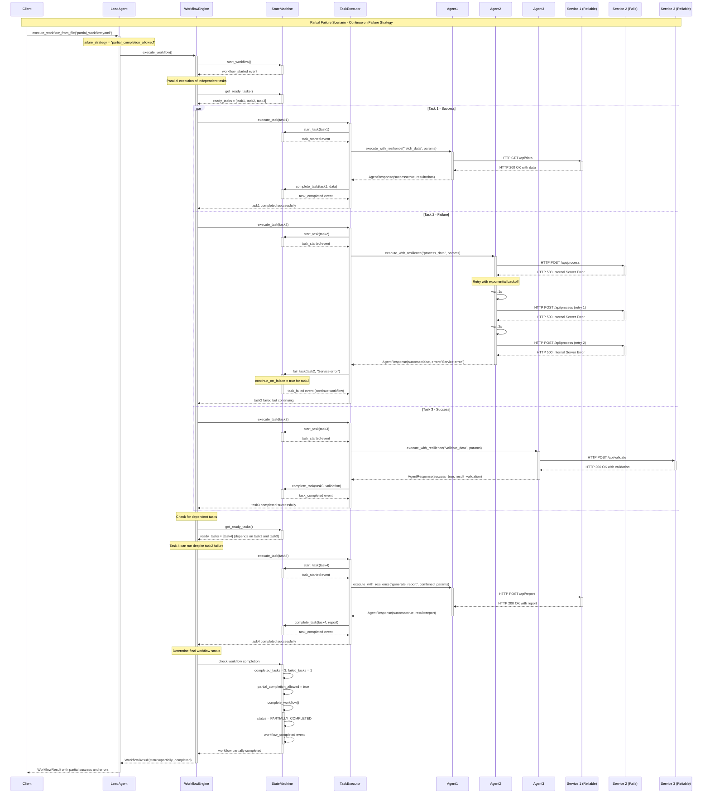

---

## 6. AI-Specific Design Patterns

The system implements advanced patterns specifically designed for AI workflow orchestration.

### 6.1 AI Workflow Patterns

```mermaid
classDiagram
    %% AI Workflow Orchestration Patterns
    
    %% Multi-Agent Orchestration Pattern
    class AIWorkflowOrchestrator {
        -agents: Dict[str, AIAgent]
        -conversation_context: ConversationContext
        -decision_engine: DecisionEngine
        +orchestrate_multi_agent_workflow(workflow: AIWorkflowConfig) AIWorkflowResult
        +coordinate_agent_interactions(agents: List[AIAgent]) void
        +manage_conversation_flow(context: ConversationContext) void
        +resolve_conflicts(responses: List[AIResponse]) AIResponse
    }
    
    class ConversationContext {
        +conversation_id: str
        +history: List[Message]
        +shared_memory: Dict[str, Any]
        +current_topic: str
        +participants: List[str]
        +add_message(message: Message) void
        +get_context_for_agent(agent_name: str) Dict[str, Any]
        +update_shared_memory(key: str, value: Any) void
    }
    
    class DecisionEngine {
        -decision_rules: List[DecisionRule]
        -voting_mechanism: VotingMechanism
        +make_routing_decision(context: ConversationContext) str
        +resolve_consensus(responses: List[AIResponse]) AIResponse
        +evaluate_response_quality(response: AIResponse) float
        +select_best_agent(task: AITask, agents: List[AIAgent]) AIAgent
    }
    
    %% Chain of Thought Pattern
    class ChainOfThoughtProcessor {
        -reasoning_steps: List[ReasoningStep]
        -verification_agent: AIAgent
        +process_with_reasoning(query: str, context: Dict) ChainOfThoughtResult
        +decompose_problem(problem: str) List[SubProblem]
        +solve_step_by_step(steps: List[ReasoningStep]) List[StepResult]
        +verify_reasoning_chain(steps: List[ReasoningStep]) VerificationResult
    }
    
    class ReasoningStep {
        +step_id: str
        +description: str
        +input_data: Dict[str, Any]
        +reasoning_prompt: str
        +expected_output: str
        +confidence_threshold: float
        +execute(agent: AIAgent) StepResult
        +validate_output(result: StepResult) bool
    }
    
    %% Prompt Engineering Pattern
    class PromptTemplateManager {
        -templates: Dict[str, PromptTemplate]
        -context_enricher: ContextEnricher
        +get_template(template_name: str) PromptTemplate
        +render_prompt(template: PromptTemplate, context: Dict) str
        +optimize_prompt(template: PromptTemplate, feedback: List[Feedback]) PromptTemplate
        +validate_prompt_structure(prompt: str) ValidationResult
    }
    
    class PromptTemplate {
        +template_id: str
        +name: str
        +template_text: str
        +variables: List[PromptVariable]
        +constraints: List[PromptConstraint]
        +examples: List[PromptExample]
        +render(context: Dict[str, Any]) str
        +validate_context(context: Dict[str, Any]) bool
    }
    
    class ContextEnricher {
        -enrichment_strategies: List[EnrichmentStrategy]
        +enrich_context(base_context: Dict, task: AITask) Dict[str, Any]
        +add_domain_knowledge(context: Dict, domain: str) Dict[str, Any]
        +inject_examples(context: Dict, task_type: str) Dict[str, Any]
        +apply_persona(context: Dict, persona: AIPersona) Dict[str, Any]
    }
    
    %% Response Validation and Quality Assurance Pattern
    class AIResponseValidator {
        -validation_rules: List[ValidationRule]
        -quality_metrics: List[QualityMetric]
        -fallback_strategies: List[FallbackStrategy]
        +validate_response(response: AIResponse, criteria: ValidationCriteria) ValidationResult
        +assess_quality(response: AIResponse) QualityAssessment
        +apply_fallback(failed_response: AIResponse, context: Dict) AIResponse
        +continuous_quality_monitoring(responses: List[AIResponse]) QualityReport
    }
    
    class ValidationRule {
        +rule_id: str
        +rule_type: ValidationRuleType
        +criteria: ValidationCriteria
        +severity: Severity
        +validate(response: AIResponse) ValidationResult
        +get_error_message() str
    }
    
    %% AI Agent Specialization Pattern
    class SpecializedAIAgent {
        <<abstract>>
        #specialization: AISpecialization
        #domain_knowledge: DomainKnowledge
        #specialized_prompts: Dict[str, PromptTemplate]
        +get_specialization() AISpecialization
        +apply_domain_expertise(task: AITask) AITask
        +validate_domain_constraints(input: Dict) bool
    }
    
    class AnalystAIAgent {
        +analyze_data(data: Dict, analysis_type: str) AnalysisResult
        +generate_insights(data: Dict) List[Insight]
        +create_visualizations(data: Dict) List[Visualization]
        +validate_analysis_quality(result: AnalysisResult) bool
    }
    
    class CreativeAIAgent {
        +generate_content(prompt: str, style: CreativeStyle) CreativeContent
        +brainstorm_ideas(topic: str, constraints: Dict) List[Idea]
        +refine_creative_output(content: CreativeContent, feedback: Feedback) CreativeContent
        +assess_creativity_metrics(content: CreativeContent) CreativityMetrics
    }
    
    class CodeGeneratorAIAgent {
        +generate_code(specification: CodeSpec, language: str) CodeGenerationResult
        +review_code(code: str, criteria: CodeReviewCriteria) CodeReview
        +optimize_code(code: str, optimization_goals: List[str]) OptimizedCode
        +validate_code_quality(code: str) CodeQualityReport
    }
    
    %% Memory and Context Management Pattern
    class AIMemoryManager {
        -short_term_memory: ShortTermMemory
        -long_term_memory: LongTermMemory
        -episodic_memory: EpisodicMemory
        -semantic_memory: SemanticMemory
        +store_interaction(interaction: AIInteraction) void
        +retrieve_relevant_context(query: str, max_items: int) List[MemoryItem]
        +update_knowledge_base(new_knowledge: Knowledge) void
        +forget_outdated_information(retention_policy: RetentionPolicy) void
    }
    
    class ShortTermMemory {
        -working_memory: List[MemoryItem]
        -attention_mechanism: AttentionMechanism
        -capacity_limit: int
        +add_to_working_memory(item: MemoryItem) void
        +get_current_context() List[MemoryItem]
        +apply_attention_filter(items: List[MemoryItem]) List[MemoryItem]
        +clear_expired_items() void
    }
    
    %% Relationships
    AIWorkflowOrchestrator --> ConversationContext
    AIWorkflowOrchestrator --> DecisionEngine
    AIWorkflowOrchestrator --> AIAgent
    
    ChainOfThoughtProcessor --> ReasoningStep
    ChainOfThoughtProcessor --> AIAgent
    
    PromptTemplateManager --> PromptTemplate
    PromptTemplateManager --> ContextEnricher
    
    AIResponseValidator --> ValidationRule
    AIResponseValidator --> AIResponse
    
    SpecializedAIAgent <|-- AnalystAIAgent
    SpecializedAIAgent <|-- CreativeAIAgent
    SpecializedAIAgent <|-- CodeGeneratorAIAgent
    SpecializedAIAgent --> AISpecialization
    SpecializedAIAgent --> PromptTemplate
    
    AIMemoryManager --> ShortTermMemory
    AIMemoryManager --> AIInteraction
    
    AIAgent --> AIMemoryManager
    AIAgent --> PromptTemplateManager
    AIAgent --> AIResponseValidator
```

### 6.2 AI Workflow Execution

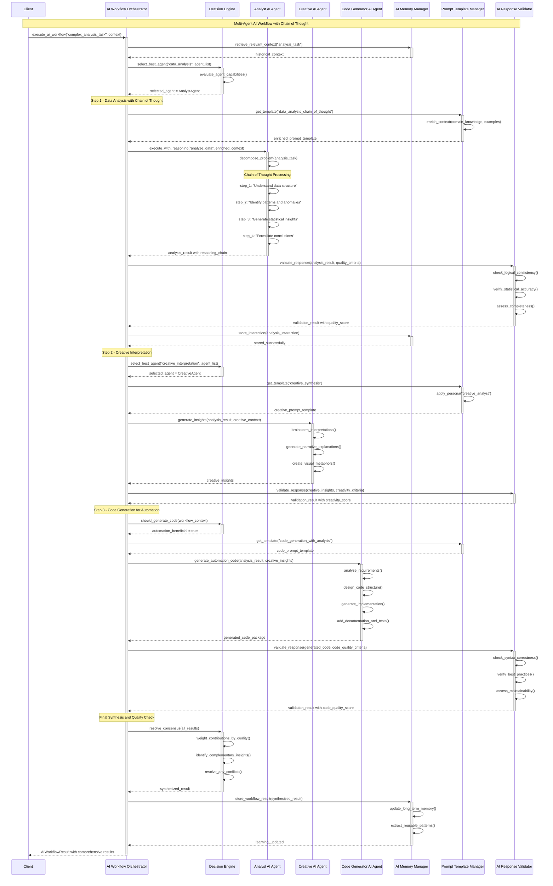

### 6.3 AI Pattern Benefits

- **Multi-Agent Orchestration**: Coordinates multiple specialized AI agents for complex tasks
- **Chain of Thought**: Enables step-by-step reasoning for better AI decision making
- **Prompt Engineering**: Dynamic template management for optimal AI interactions
- **Response Validation**: Quality assurance for AI-generated content
- **Agent Specialization**: Domain-specific expertise for different types of tasks
- **Memory Management**: Context preservation and learning from interactions

---

## 7. State Management

### 7.1 Workflow State Transitions

The system uses a sophisticated state machine to manage workflow lifecycle:

- **PENDING**: Initial state, workflow is queued for execution
- **RUNNING**: Workflow is actively executing tasks
- **COMPLETED**: All tasks completed successfully
- **PARTIALLY_COMPLETED**: Some tasks completed, others failed (with partial completion allowed)
- **FAILED**: Workflow failed due to task failures or system errors
- **CANCELLED**: Workflow was manually cancelled

### 7.2 Task State Transitions

Individual tasks follow their own state lifecycle:

- **PENDING**: Task is waiting to be executed
- **RUNNING**: Task is currently being executed
- **COMPLETED**: Task completed successfully
- **FAILED**: Task failed after all retry attempts
- **CANCELLED**: Task was cancelled before completion
- **RETRYING**: Task is waiting to be retried after a failure

---

## 8. Implementation Guidelines

### 8.1 Best Practices

#### Code Organization
- Follow the established package structure with clear separation of concerns
- Use dependency injection for better testability and flexibility
- Implement proper logging and monitoring throughout the system

#### Error Handling
- Use structured exception handling with specific exception types
- Implement comprehensive retry mechanisms with exponential backoff
- Use circuit breakers to prevent cascading failures

#### Configuration Management
- Use Pydantic models for configuration validation
- Support both file-based and programmatic configuration
- Implement configuration hot-reloading for production environments

#### Testing Strategy
- Maintain 100% test coverage for all core components
- Use mock objects for external dependencies
- Implement integration tests for end-to-end scenarios
- Test all failure scenarios and edge cases

### 8.2 Extension Points

#### Adding New Agent Types
1. Implement the `BaseAgent` interface
2. Register the new agent type with `AgentFactory`
3. Add configuration models for the new agent type
4. Implement appropriate resilience patterns

#### Custom Resilience Patterns
1. Implement pattern-specific classes following existing patterns
2. Integrate with the `ResilienceDecorator`
3. Add configuration options for the new pattern
4. Update documentation and examples

#### AI-Specific Extensions
1. Implement specialized AI agent classes
2. Create domain-specific prompt templates
3. Add validation rules for AI responses
4. Implement memory management strategies

### 8.3 Performance Considerations

#### Scalability
- Use async/await patterns throughout for non-blocking operations
- Implement connection pooling for HTTP clients
- Use resource pools to limit concurrent operations
- Consider horizontal scaling for high-throughput scenarios

#### Memory Management
- Implement proper cleanup of resources after task completion
- Use streaming for large data processing
- Implement memory-efficient data structures
- Monitor memory usage and implement garbage collection strategies

#### Monitoring and Observability
- Implement comprehensive metrics collection
- Use structured logging for better observability
- Add health checks for all components
- Implement distributed tracing for complex workflows

---

## 9. Conclusion

The Lead Agent system represents a sophisticated approach to AI workflow orchestration, combining proven design patterns with modern resilience practices. The architecture provides:

### 9.1 Key Strengths

- **Modularity**: Clean separation of concerns enables easy maintenance and extension
- **Reliability**: Comprehensive error handling and resilience patterns ensure robust operation
- **Flexibility**: Support for both sequential and parallel execution strategies
- **Observability**: Event-driven architecture provides comprehensive monitoring capabilities
- **Extensibility**: Plugin-based architecture allows easy addition of new agent types and patterns

### 9.2 Design Philosophy

The system follows several key design principles:

- **Fail-Fast**: Quick failure detection with circuit breakers and timeouts
- **Graceful Degradation**: Partial completion capabilities and fallback strategies
- **Event-Driven**: Comprehensive event system for monitoring and integration
- **Configuration-Driven**: Declarative workflow definitions for easy management
- **AI-First**: Specialized patterns for AI workflow orchestration

### 9.3 Future Enhancements

The architecture provides a solid foundation for future enhancements:

- **Advanced AI Patterns**: Integration of more sophisticated AI coordination patterns
- **Distributed Execution**: Support for distributed workflow execution across multiple nodes
- **Visual Workflow Designer**: Graphical interface for workflow creation and monitoring
- **Advanced Analytics**: Machine learning-based workflow optimization
- **Enterprise Integration**: Enhanced security, audit trails, and compliance features

This design document serves as both a reference for understanding the current system and a blueprint for future development. The comprehensive visual documentation ensures that developers can quickly understand the system architecture and contribute effectively to its continued evolution.

---

**Document Version**: 1.0  
**Last Updated**: 2024  
**Authors**: Lead Agent Development Team  
**Review Status**: Approved
